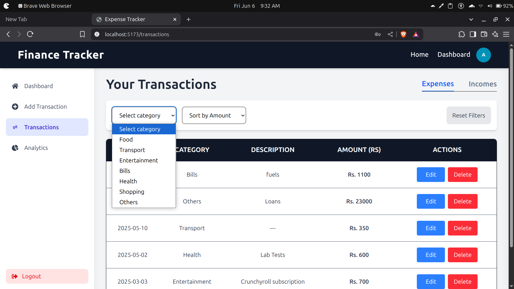
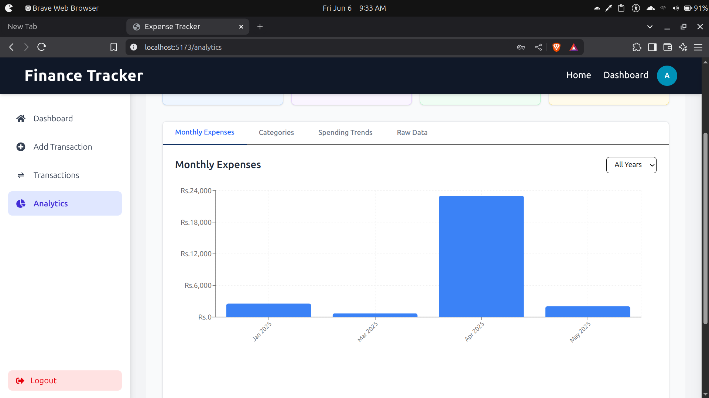

# Finance Tracker (MERN)

A lightweight full-stack Finance Tracker built with the **MERN** stack (MongoDB · Express.js · React · Node.js). Quickly log your income & expenses, visualize spending habits, and stay on top of your budget with real-time updates and a clean, responsive interface.

---

## Screenshots

